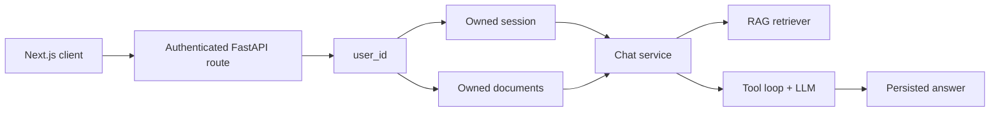

# AI Assistant Backend

This is the backend service for the AI Assistant application. It's built with FastAPI and provides the core functionality including authentication, document processing, retrieval-augmented generation (RAG), and AI model interactions.

## What This Backend Does

The backend handles all the server-side logic for the AI assistant:

- **Authentication**: Manages user sessions through Google OAuth
- **Document Processing**: Accepts file uploads, extracts text, creates embeddings, and stores them in a vector database
- **Chat Service**: Orchestrates the complete flow of answering questions with RAG and tool calling
- **AI Integration**: Connects to language models (Hugging Face or local vLLM) with automatic fallback
- **Rate Limiting**: Enforces per-user request limits using Redis
- **Data Persistence**: Stores all user data in PostgreSQL with proper isolation

## Key Features

- Asynchronous FastAPI endpoints for better performance
- Support for Hugging Face hosted models with automatic fallback to backup models
- Optional local model deployment using vLLM for GPU acceleration
- Structured JSON output from the AI model with schema validation
- Tool-calling capabilities (calculator, time, weather)
- Document ingestion for Markdown, text, and PDF files
- Vector search using Qdrant with hybrid retrieval and reranking
- Document citations in chat responses
- Automatic cleanup of expired documents
- Docker support with optional GPU profile

## How Requests Flow Through the System



**User Isolation:**

Every request includes an authenticated `user_id`. This ID is used throughout the system to ensure that:

- Users can only access their own chat sessions
- Document retrieval is limited to files uploaded by that user
- All database queries are scoped to the authenticated user
- Clients cannot access another user's data by manipulating IDs

## Project Structure

```text
app/
├── api/          # HTTP routes and authentication dependencies
├── assistant/    # AI agent logic and tool execution
├── auth/         # Google OAuth token verification
├── core/         # Configuration settings and logging
├── db/           # Database models and session management
├── llm/          # Language model client (Hugging Face/vLLM)
├── rag/          # Document processing, embeddings, and retrieval
├── schemas/      # Pydantic models for requests and responses
├── services/     # Business logic (chat, ingestion, cleanup)
└── tools/        # Tool implementations (calculator, weather, time)
data/documents/   # Sample documents for testing
notebooks/        # Google Colab notebook for vLLM setup
scripts/          # Utility scripts for document management
```

## Requirements

To run this backend, you need:

- **Python 3.11 or 3.12** - The application is tested with these versions
- **PostgreSQL 15 or newer** - For persistent data storage
- **Hugging Face access token** - For using hosted language models, OR
- **vLLM endpoint** - For local model deployment (requires GPU)
- **Qdrant Cloud cluster** - For vector storage and search
- **ngrok account** - Only needed if using vLLM from Google Colab

**Note:** vLLM requires a compatible GPU and is optional. The standard setup uses hosted Hugging Face models.

## Local Development Setup

### Step 1: Configure Environment

Copy the example environment file:

```bash
cp .env.example .env
```

On Windows PowerShell:

```powershell
Copy-Item .env.example .env
```

Edit `.env` and fill in the required values:
- `DATABASE_URL` - PostgreSQL connection string
- `HF_TOKEN` - Your Hugging Face API token
- `QDRANT_URL` - Your Qdrant Cloud URL
- `QDRANT_API_KEY` - Your Qdrant API key

**Important:** Never commit `.env` to version control as it contains sensitive credentials.

### Step 2: Install Dependencies

Create a virtual environment and install the package:

```bash
python -m venv .venv
source .venv/bin/activate
pip install -e ".[dev]"
```

On Windows PowerShell:

```powershell
.venv\Scripts\Activate.ps1
pip install -e ".[dev]"
```

### Step 3: Set Up the Database

Apply database migrations:

```bash
alembic upgrade head
```

**Note:** Always use Alembic for schema changes. Do not use `Base.metadata.create_all()`.

### Step 4: Run the Application

Start the development server:

```bash
uvicorn app.main:app --reload
```

The API will be available at:
- Interactive docs: http://localhost:8000/api/docs
- Health check: http://localhost:8000/api/v1/health

### Optional: Run Dependencies with Docker

If you want to run PostgreSQL and Redis via Docker:

```bash
docker compose up -d db redis
alembic upgrade head
```

## Document Ingestion

### Uploading via API

Protected endpoints require an HttpOnly session cookie from `POST /api/v1/auth/google`. The examples below assume you have saved this cookie to `cookies.txt`.

Upload a document:

```bash
curl -X POST http://localhost:8000/api/v1/documents \
  -H "accept: application/json" \
  -b cookies.txt \
  -F "file=@data/documents/example.md;type=text/markdown"
```

The response includes a document UUID that you'll need when sending chat messages.

### Uploading via Script

For administrative purposes, you can ingest documents directly for a known user:

```bash
python scripts/ingest_documents.py \
  data/documents/example.md \
  --user-id USER_UUID
```

### How Ingestion Works

The ingestion pipeline:

1. Validates the file type (supports MD, TXT, PDF)
2. Extracts text content from the file
3. Splits text into overlapping chunks
4. Creates vector embeddings for each chunk
5. Stores metadata in PostgreSQL
6. Stores vectors in Qdrant with user-scoped access

Qdrant Cloud provides hybrid retrieval (dense + sparse search) with ColBERT reranking. If cloud inference is unavailable, the system falls back to local dense embeddings.

### Document Cleanup

Documents have an expiry time and are automatically removed:

- A background worker runs at startup and at regular intervals
- Expired documents are deleted from both PostgreSQL and Qdrant
- You can also run cleanup manually with the cleanup script
- Set `DOCUMENT_CLEANUP_INTERVAL_SECONDS=0` to disable automatic cleanup

## Sending Chat Messages

### Non-Streaming Request

```bash
curl -X POST http://localhost:8000/api/v1/chat \
  -H "Content-Type: application/json" \
  -b cookies.txt \
  -d '{
    "session_id": "SESSION_UUID",
    "message": "What information does this document contain?",
    "document_ids": ["DOCUMENT_UUID"]
  }'
```

### How Chat Processing Works

1. **Authentication**: The request must include a valid session cookie
2. **Session Loading**: Chat history is loaded from PostgreSQL (not from the client)
3. **Document Verification**: The service verifies that requested documents belong to the authenticated user
4. **Retrieval**: If documents are attached, relevant chunks are retrieved from Qdrant
5. **AI Generation**: The agent processes the question with context and available tools
6. **Response**: The answer includes citations, tool executions, model info, and statistics

**Security Note:** The retriever only receives validated document IDs, preventing cross-user data access.

### Tool Calling

The AI agent can use tools to answer questions:
- Calculator for mathematical operations
- UTC time for current time information
- Weather API for current weather data

If a tool fails, the error is returned to the model so it can retry or try a different approach.

## Streaming Chat

For real-time responses, use the streaming endpoint:

```bash
curl -X POST http://localhost:8000/api/v1/chat/stream \
  -H "Content-Type: application/json" \
  -b cookies.txt \
  -d '{
    "session_id": "SESSION_UUID",
    "message": "Explain the main points",
    "document_ids": ["DOCUMENT_UUID"]
  }'
```

### SSE Event Types

The streaming endpoint emits Server-Sent Events in this order:

| Event | Description |
| --- | --- |
| `status` | Current progress (retrieving, generating, etc.) |
| `tool` | Result of a tool execution (including failures) |
| `delta` | Fragment of the streaming answer text |
| `complete` | Final validated answer with metadata |
| `error` | Error during processing |

### Message Persistence

- A pending assistant message is created before generation starts
- On completion: final response is saved with status `complete`
- On cancellation: received text is saved with status `stopped`
- On failure: received text is saved with status `error`
- The `complete` event is only emitted after metadata validation passes

## Manual Document Cleanup

The API automatically checks for expired documents at startup and at regular intervals. To run cleanup manually:

```bash
python -m scripts.cleanup_documents
```

To disable automatic cleanup, set `DOCUMENT_CLEANUP_INTERVAL_SECONDS=0` in your `.env` file.

## Language Model Configuration

### Option 1: Hugging Face (Recommended)

Configure in `.env`:

```env
LLM_BACKEND=huggingface
HF_MODEL=openai/gpt-oss-20b:groq
HF_FALLBACK_MODEL=deepseek-ai/DeepSeek-V4-Flash-0731:deepinfra
```

**How Fallback Works:**

If the primary model fails (API error, timeout, rate limit, or server error) before streaming starts, the system automatically retries with the fallback model. Once streaming begins, partial output is never mixed with a different model.

### Option 2: Local vLLM (GPU Required)

For local deployment with GPU acceleration:

```env
LLM_BACKEND=vllm
VLLM_BASE_URL=http://localhost:8001/v1
VLLM_API_KEY=local-only
VLLM_MODEL=Qwen/Qwen2.5-1.5B-Instruct
```

### Option 3: vLLM on Google Colab

To use a free GPU from Google Colab:

1. Open the [Colab notebook](notebooks/vllm_colab.ipynb)
2. Select a GPU runtime
3. Add `NGROK_AUTHTOKEN` and `VLLM_API_KEY` to Colab Secrets
4. Run the notebook to start the model
5. Copy the ngrok URL that appears

Configure your backend:

```env
LLM_BACKEND=vllm
VLLM_BASE_URL=https://your-ngrok-domain.ngrok-free.app/v1
VLLM_API_KEY=your-private-key
VLLM_MODEL=Qwen/Qwen2.5-14B-Instruct-AWQ
```

**Security Note:** The ngrok URL is temporary and publicly reachable, but the vLLM API key protects the endpoints. Stop the Colab runtime after testing.

## Docker Deployment

### Standard Deployment (Hosted Models)

Run the API with hosted Hugging Face models:

```bash
docker compose up --build api
```

### Local GPUdeployment

If you have an NVIDIA GPU and NVIDIA Container Toolkit installed:

```bash
docker compose --profile local up --build
```

**Important:** Set `LLM_BACKEND=vllm` in your `.env` before using the local profile. The API connects to vLLM at `http://vllm:8000/v1` within the Docker network.

## Code Quality Checks

Run these commands to verify code quality:

```bash
ruff format --check .  # Check formatting
ruff check .           # Lint code
mypy app               # Type checking
pytest                 # Run tests
```

## API Endpoints Reference

| Method | Endpoint | Description |
| --- | --- | --- |
| `GET` | `/api/v1/health` | Health check for monitoring |
| `POST` | `/api/v1/auth/google` | Authenticate with Google OAuth |
| `GET` | `/api/v1/auth/me` | Get current user info |
| `POST` | `/api/v1/auth/logout` | End current session |
| `GET` | `/api/v1/sessions` | List all chat sessions |
| `POST` | `/api/v1/sessions` | Create new session |
| `GET` | `/api/v1/sessions/{id}` | Get session details |
| `PATCH` | `/api/v1/sessions/{id}` | Rename session |
| `DELETE` | `/api/v1/sessions/{id}` | Delete session |
| `POST` | `/api/v1/documents` | Upload single document |
| `POST` | `/api/v1/documents/batch` | Upload multiple documents |
| `POST` | `/api/v1/chat` | Send message (non-streaming) |
| `POST` | `/api/v1/chat/stream` | Send message (streaming) |

## Technical Notes

### ONNX for Embeddings

ONNX conversion is not currently used for the generative model because vLLM provides optimized GPU inference with continuous batching and paged attention. Converting to ONNX would bypass these optimizations. The embedding model runs on CPU where ONNX could be evaluated later if profiling shows it would improve performance.
