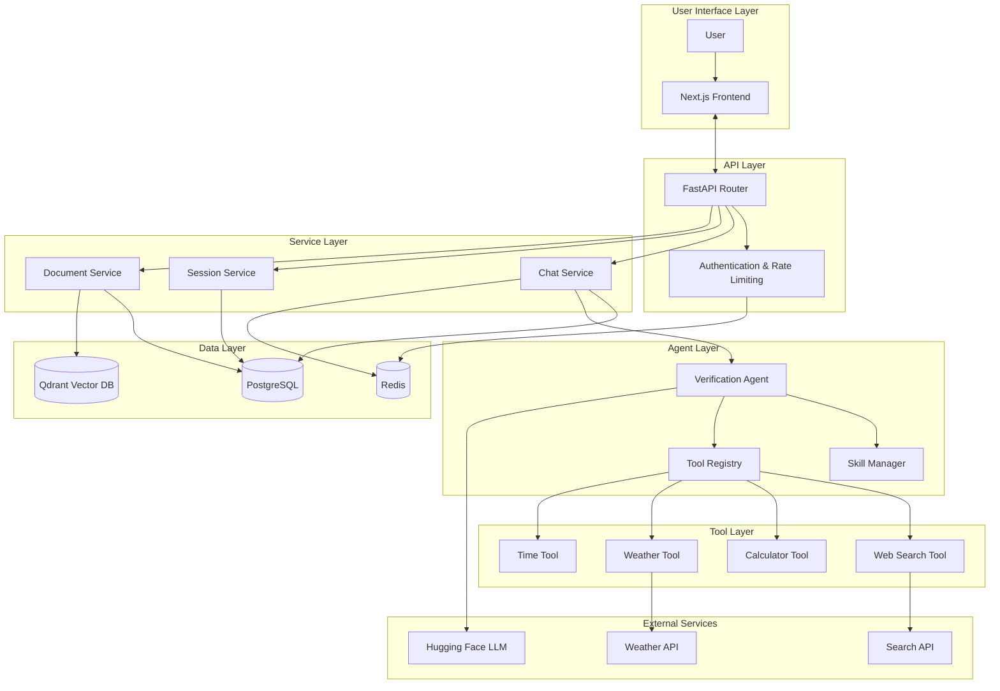
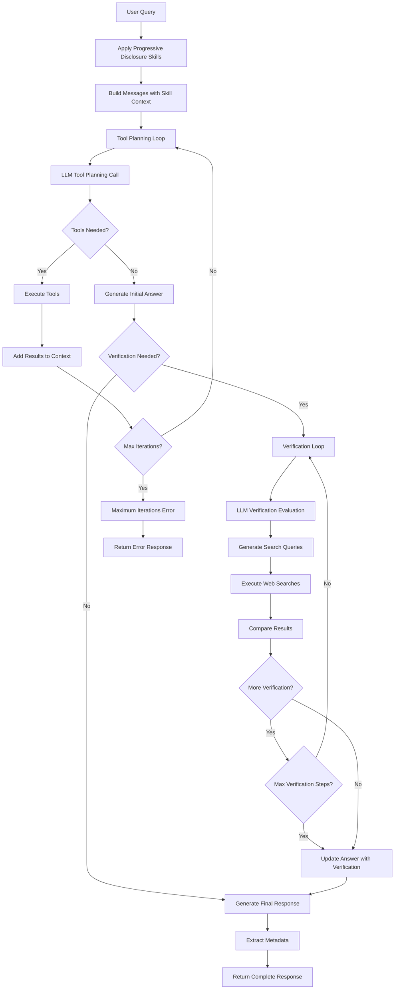

# Agentic Verification Architecture

## Enhanced System Architecture with Agentic Verification



## Agentic Verification Loop Detail



## Multi-Agent vs Single-Agent Decision

### Single-Agent Design (Chosen)

The verification system uses a single-agent design rather than a multi-agent system for the following reasons:

1. **Sequential Nature**: The verification process is inherently sequential (answer → evaluate → search → update), with no natural parallelization opportunities.

2. **Context Coherence**: Maintaining the original question, initial answer, and verification results in a single conversation flow is more straightforward than coordinating state across multiple agents.

3. **Reduced Overhead**: Avoids the complexity of inter-agent communication protocols, message passing, and state synchronization.

4. **No Specialization Benefit**: The verification task doesn't require distinct specialized knowledge bases that would benefit from agent specialization.

### Avoided Structural Failures

- **Sequential Bottleneck**: Single agent avoids the wait times inherent in multi-agent coordination
- **Context Saturation**: Single shared context window instead of multiple agent contexts
- **Skill Dilution**: No dilution of capabilities across multiple agents
- **Single Point of Failure**: Simpler architecture with fewer coordination failure modes

## Context Engineering: Progressive Disclosure

### Implementation

The SkillManager implements progressive disclosure by:

1. **Initial Context**: Loads only 1-2 sentence summaries for each skill (verification, research, comparison)
2. **Trigger Detection**: Analyzes user queries for trigger keywords indicating skill relevance
3. **Dynamic Loading**: Loads full skill instructions only when relevant keywords are detected
4. **State Tracking**: Maintains set of loaded skills to avoid redundant loading

### Benefits

- **Reduced Token Usage**: Initial context is ~70% smaller than loading all full instructions
- **Focused Context**: Only relevant detailed instructions are provided when needed
- **Scalability**: Easy to add new skills without bloating initial context
- **Flexibility**: Skills can be loaded from external files or defined programmatically

### Example

**Without Progressive Disclosure:**
```
System: [Full verification instructions - 200 tokens]
       [Full research instructions - 180 tokens] 
       [Full comparison instructions - 150 tokens]
       [Base system prompt - 300 tokens]
Total: ~830 tokens
```

**With Progressive Disclosure:**
```
System: [Verification summary - 20 tokens]
       [Research summary - 15 tokens]
       [Comparison summary - 15 tokens]
       [Base system prompt - 300 tokens]
Total: ~350 tokens (saves ~480 tokens per query)
```

When verification is triggered, the full instructions (200 tokens) are added, but only for relevant queries.