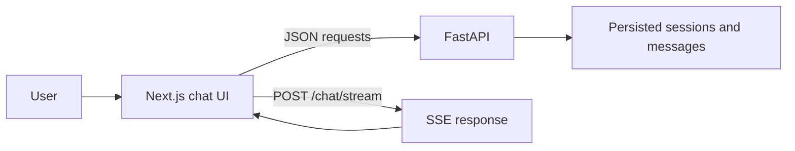

# AI Assistant Frontend

This is the frontend application for the AI Assistant. It's built with Next.js and provides the user interface for chatting with the AI, managing documents, and handling authentication.

## What This Frontend Does

The frontend handles all user-facing functionality:

- **Authentication**: Google OAuth sign-in and session management
- **Chat Interface**: Real-time chat with streaming responses
- **Session Management**: Create, rename, delete, and switch between chat sessions
- **Document Upload**: Upload and attach documents to chat conversations
- **Rich Display**: Markdown rendering, LaTeX math, code syntax highlighting, and Mermaid diagrams
- **Tool Visualization**: Display when the AI uses external tools
- **Citations**: Show document sources referenced in AI responses

## How It Works



**Data Flow:**

- All sessions and messages are loaded from the backend API (not stored in browser)
- The active session is kept in React state for fast access
- Session details are loaded lazily when you select a session
- Chat requests include the session ID and any attached document IDs
- Responses stream in real-time using Server-Sent Events (SSE)

### Streaming Event Handling

The frontend processes Server-Sent Events from the backend:

| Event | What Happens |
| --- | --- |
| `status` | Updates the activity indicator (e.g., "Retrieving documents", "Generating response") |
| `tool` | Displays tool execution results in the chat |
| `delta` | Appends text to the visible answer as it streams in |
| `complete` | Replaces the draft with the final validated answer including citations and metadata |
| `error` | Marks the message as failed and shows the error |

**Stop Button:**

When you click stop, the frontend aborts the active request using AbortController. Any text received before cancellation remains visible, and the backend saves the partial response with status `stopped`.

### Session and Document Management

**Sessions:**

- The sidebar lets you create, select, rename, and delete chat sessions
- Renaming sends a `PATCH /sessions/{id}` request and shows a success toast only after the server confirms
- Empty session titles are rejected by the editor
- Deleting a session removes it from the sidebar after server confirmation

**Documents:**

- Documents are uploaded before sending a message
- Only successfully uploaded documents (status: ready) can be attached to chat requests
- Failed uploads remain visible with their error state so you can retry
- Documents can be removed before sending the message

## Local Development Setup

### Step 1: Configure Environment

Copy the example environment file:

```powershell
Copy-Item .env.example .env
```

Edit `.env` and set these values:

```env
BACKEND_URL=http://localhost:8000
NEXT_PUBLIC_GOOGLE_CLIENT_ID=your-google-web-client-id
NEXT_PUBLIC_API_URL=/backend/api/v1
```

**Note:** `NEXT_PUBLIC_GOOGLE_CLIENT_ID` must be public because Google requires the browser to initialize the sign-in button.

### Step 2: Install Dependencies

```powershell
yarn install
```

### Step 3: Start the Development Server

```powershell
yarn dev
```

Open http://localhost:3000 in your browser.

**Important:** The backend API must be running at `BACKEND_URL`. The `/backend` path in `NEXT_PUBLIC_API_URL` is a Next.js rewrite that proxies requests to the FastAPI backend, keeping the authentication cookie first-party for security.

## Setting Up Google OAuth

### Create OAuth Client

1. Go to the [Google Cloud Console](https://console.cloud.google.com/)
2. Create a new project or select an existing one
3. Navigate to APIs & Services > Credentials
4. Create credentials > OAuth client ID
5. Choose "Web application" as the application type

### Configure Authorized Origins

Add these URLs to "Authorized JavaScript origins":

```text
http://localhost:3000
https://your-production-domain.example
```

### Use the Client ID

Use the same Google Client ID in both places:
- Frontend: `NEXT_PUBLIC_GOOGLE_CLIENT_ID` in `.env`
- Backend: `GOOGLE_CLIENT_ID` in the backend `.env`

## Code Quality Checks

Run these commands to verify the code:

```powershell
yarn typecheck  # TypeScript type checking
yarn lint       # ESLint linting
yarn build      # Production build
```

Use `yarn dev` for local development and `yarn start` to serve a production build.

## Docker Deployment

The backend Docker Compose file builds the complete stack including the frontend:

```powershell
cd ../backend
docker compose up -d --build
```

### Production Configuration

Before deploying to production, configure the backend `.env` with:

```env
GOOGLE_CLIENT_ID=your-google-web-client-id
AUTH_COOKIE_SECURE=true
CORS_ORIGINS='["https://your-production-domain.example"]'
```

### Security Considerations

- Expose the frontend on HTTPS
- Keep PostgreSQL and Redis private (not publicly accessible)
- Avoid exposing FastAPI directly if all traffic goes through the frontend rewrite
- The vLLM service is only started with the `local` Compose profile
