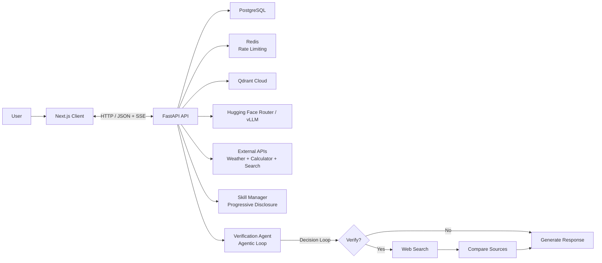
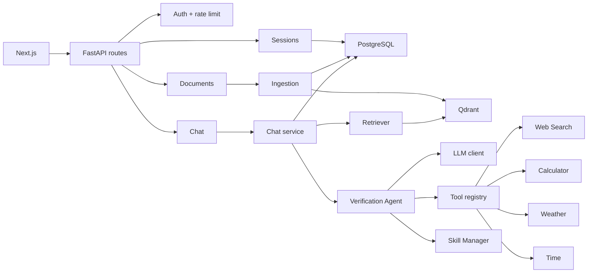
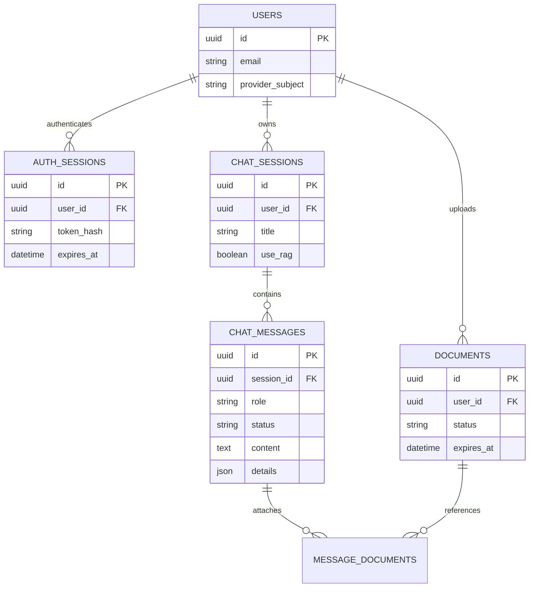
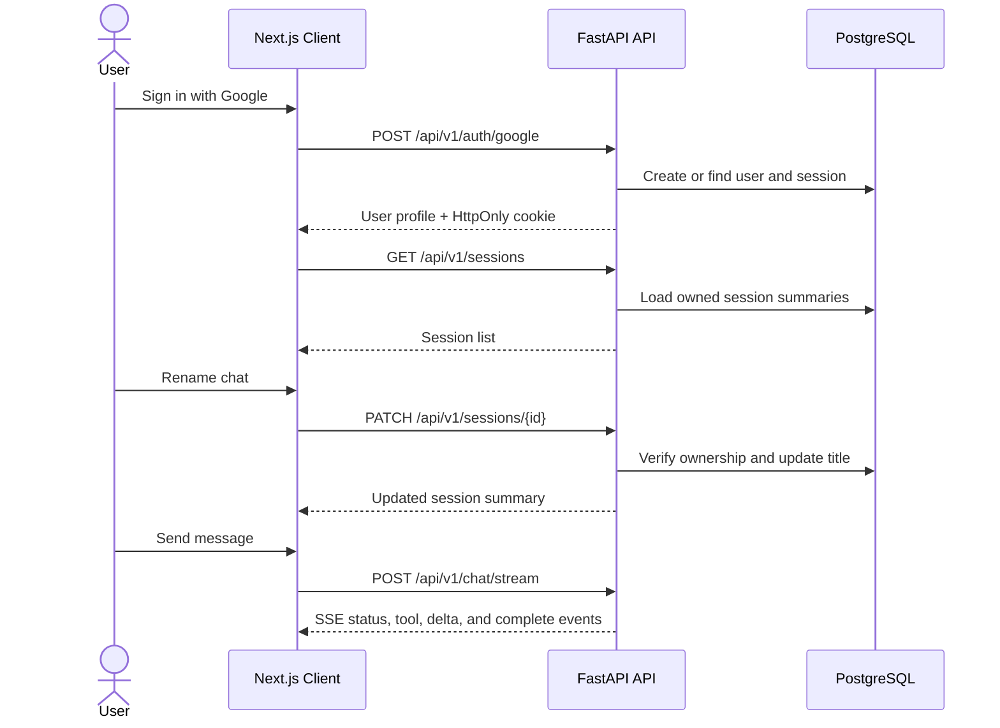
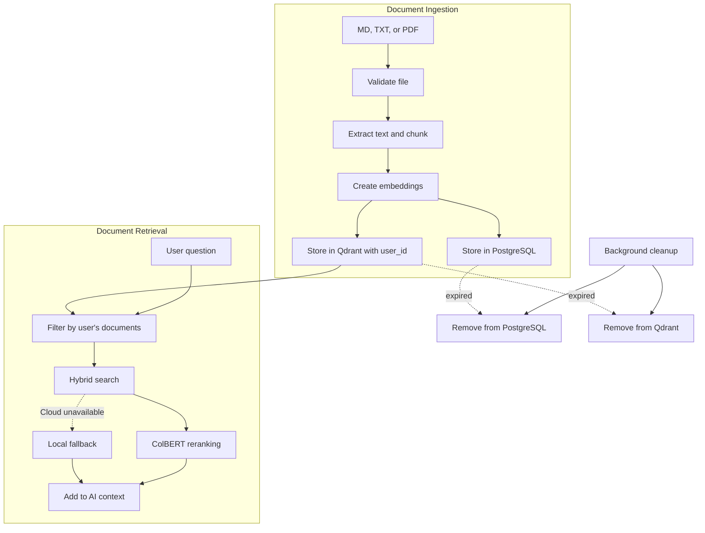
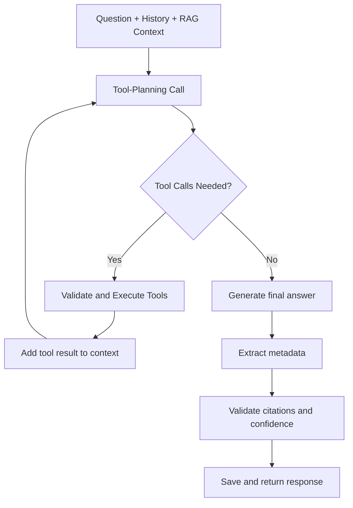
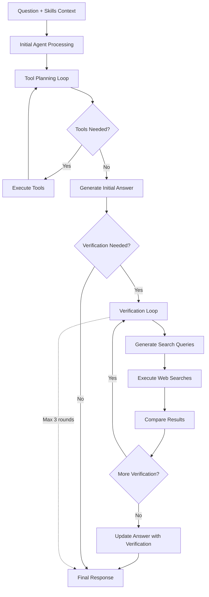
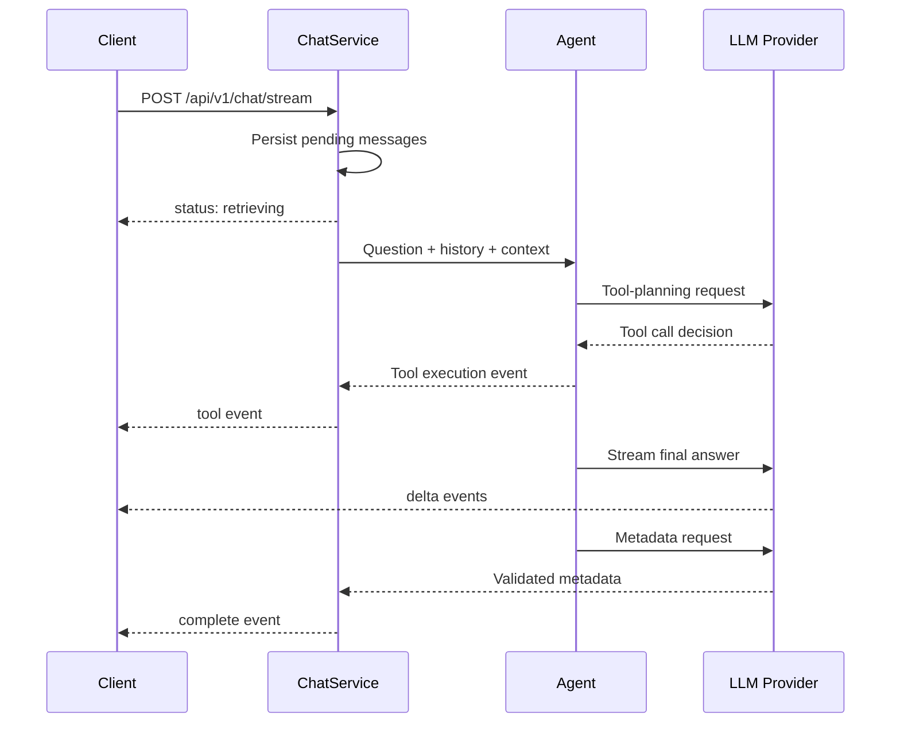
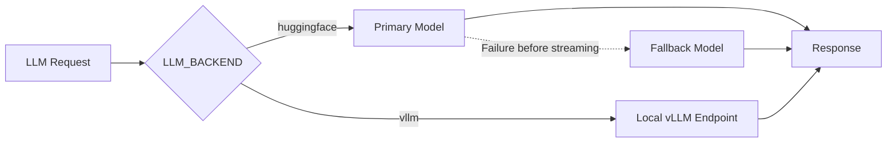
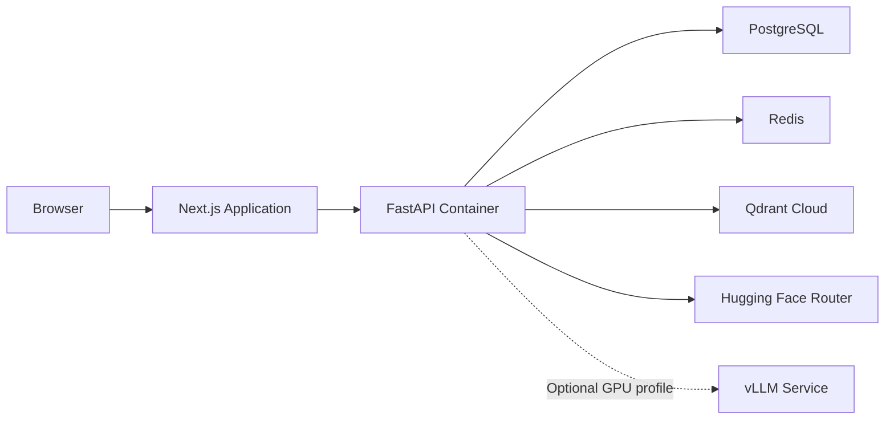

# AI Assistant System Architecture with Agentic Verification

This project is a full-stack AI assistant application that combines retrieval-augmented generation (RAG) with tool calling capabilities and agentic verification. The system consists of two main components:

- **Frontend**: A Next.js application that handles user interaction, authentication, and real-time chat streaming
- **Backend**: A FastAPI service that manages authentication, document processing, RAG retrieval, AI model interactions, and agentic verification loops

## Week 16 Extension: Agentic Verification Feature

This implementation extends the Week 15 assistant with cross-source verification capabilities, allowing the AI agent to evaluate whether information needs verification from multiple sources and decide whether to perform additional searches before responding.

## System Overview

The application uses a client-server architecture where the frontend communicates with the backend through HTTP requests and Server-Sent Events (SSE) for real-time streaming.

**Key Design Decisions:**

- **Authentication**: Uses Google OAuth with HttpOnly cookies. The backend stores only a hash of the session token in PostgreSQL
- **Data Isolation**: All user data (sessions, messages, documents) is scoped to the authenticated user ID
- **Rate Limiting**: Redis enforces a limit of 10 chat requests per user per 60 seconds
- **API Versioning**: All backend endpoints use the `/api/v1` prefix

---

## Backend Component Architecture

The backend is organized into several interconnected services that handle different aspects of the application:

**Component Responsibilities:**

- **API Routes**: Handle HTTP requests, enforce authentication, apply rate limits, and manage error responses
- **Session Service**: Manage chat session lifecycle (create, list, rename, delete)
- **Chat Service**: Orchestrate the complete chat flow including history loading, RAG retrieval, and AI generation
- **Ingestion Service**: Process uploaded documents (validation, text extraction, chunking, vectorization)
- **Retriever**: Search vector database for relevant document chunks based on user queries
- **Verification Agent**: Enhanced agent with cross-source verification capabilities, progressive disclosure through Skills, and agentic decision-making loops
- **Skill Manager**: Manages progressive disclosure of skill instructions, loading concise summaries initially and full instructions when relevant
- **Tool Registry**: Manage available tools (calculator, weather, time, web search) and validate their execution
- **LLM Client**: Interface with language model providers (Hugging Face or local vLLM)
- **Databases**: PostgreSQL for persistent data, Qdrant for vector storage, Redis for rate limiting

---

## Database Schema

The database uses PostgreSQL with the following entity relationships:

**Data Ownership Model:**

- Every piece of data is linked to a specific user through foreign key relationships
- Cascade deletion ensures that when a user is deleted, all their sessions, messages, and documents are removed
- Sessions can be renamed or deleted through the API
- Documents can be attached to specific messages within a session

---

## User Interaction Flow

The following sequence shows how a user interacts with the system from sign-in to sending a message:

**Frontend State Management:**

- Chat sessions are loaded from the API and stored in React state
- Session details are loaded lazily when a session is selected
- The active session is kept in memory during the chat
- When generation is stopped, the frontend aborts the request but retains received text
- The backend marks stopped messages with status `stopped`

---

## Document Processing Pipeline

Documents go through an ingestion pipeline when uploaded and a retrieval pipeline when referenced in chat:

**Ingestion Process:**

- Supports single and batch file uploads (Markdown, text, and PDF)
- Documents are validated, text is extracted, and content is split into overlapping chunks
- Each chunk is converted to a vector embedding and stored in Qdrant
- Metadata (filename, status, expiry) is stored in PostgreSQL
- Documents are scoped to the authenticated user and deduplicated by content hash
- A background worker automatically removes expired documents from both databases

**Retrieval Process:**

- The chat service verifies that requested documents belong to the authenticated user
- Only validated document IDs are passed to the retriever (preventing cross-user access)
- Qdrant performs hybrid search (dense + sparse) with ColBERT reranking
- If cloud inference is unavailable, the system falls back to local dense embeddings
- Retrieved chunks are formatted and added to the AI model's context

---

## AI Agent Execution Flow

The AI agent uses a tool-calling approach to answer questions with the help of external utilities:

**Enhanced Agentic Verification Flow:**

**Agent Behavior:**

- The agent can run up to 15 tool-planning rounds (configurable via `LLM_MAX_TOOL_ITERATIONS`)
- Available tools include: calculator, UTC time, weather information
- Tool arguments are validated using Pydantic schemas
- Failed tool calls are returned as explicit results, allowing the model to retry or try a different tool
- The final answer is generated in a separate request without tool definitions
- After the answer stream completes, a separate request extracts structured metadata (citations, confidence scores, follow-up questions)
- Metadata is validated before the response is marked complete

---

## Streaming Chat Implementation

The chat endpoint uses Server-Sent Events (SSE) to stream responses in real-time:

**SSE Event Types:**

| Event | Description |
| --- | --- |
| `status` | Current progress (retrieving, generating, etc.) |
| `tool` | Result of a tool execution |
| `delta` | Fragment of the streaming answer text |
| `complete` | Final validated answer with metadata |
| `error` | Recoverable error during processing |

**Request Lifecycle:**

1. Request passes authentication and Redis rate limit (10 requests/60 seconds per user)
2. Chat service verifies session ownership and document permissions
3. Pending user and assistant messages are persisted to PostgreSQL
4. Document context is retrieved and passed to the agent
5. Agent executes tools and streams the answer
6. After streaming completes, metadata is extracted and validated
7. Complete message is persisted and `complete` event is emitted

**Frontend Event Handling:**

- `status`: Updates the activity indicator
- `tool`: Displays tool execution results
- `delta`: Appends text to the visible answer
- `complete`: Replaces draft with final answer including citations and metadata
- `error`: Marks the message as failed
- Stop button uses AbortController to cancel requests; received text is preserved with status `stopped`

---

## Language Model Configuration

The system supports two backend options for language models:

**Backend Options:**

- **Hugging Face**: Uses hosted models through the Hugging Face Router with automatic fallback
- **vLLM**: Uses a local or remote OpenAI-compatible endpoint (useful for GPU acceleration)

**Failure Handling:**

- If the primary model fails before streaming starts, the system automatically retries with the fallback model
- Once streaming begins, partial output is never mixed with a different model
- The weather API client includes a retry mechanism with timeout handling
- Tool planning is bounded to prevent infinite loops

---

## API Endpoints

The backend exposes the following HTTP endpoints:

| Method | Endpoint | Purpose |
| --- | --- | --- |
| `GET` | `/api/v1/health` | Health check for monitoring |
| `POST` | `/api/v1/auth/google` | Authenticate with Google OAuth |
| `GET` | `/api/v1/auth/me` | Get current user information |
| `POST` | `/api/v1/auth/logout` | End the current session |
| `GET` | `/api/v1/sessions` | List all chat sessions |
| `POST` | `/api/v1/sessions` | Create a new chat session |
| `GET` | `/api/v1/sessions/{id}` | Get session details |
| `PATCH` | `/api/v1/sessions/{id}` | Rename a session |
| `DELETE` | `/api/v1/sessions/{id}` | Delete a session |
| `POST` | `/api/v1/documents` | Upload a single document |
| `POST` | `/api/v1/documents/batch` | Upload multiple documents |
| `POST` | `/api/v1/chat` | Send a chat message (non-streaming) |
| `POST` | `/api/v1/chat/stream` | Send a chat message (streaming) |

**Security Features:**

- All protected endpoints require authentication via HttpOnly cookie
- Chat requests are rate-limited per user using Redis
- Document access is validated to ensure users can only access their own files
- Errors are returned as HTTP errors for non-streaming endpoints or SSE events for streaming

---

## Deployment Architecture

The system can be deployed using Docker Compose with the following components:

**Deployment Options:**

- **Standard**: Runs the API, frontend, PostgreSQL, Redis, and connects to hosted Qdrant and Hugging Face
- **Local GPU**: Adds a local vLLM service for GPU-accelerated inference (requires NVIDIA GPU)
- **Colab**: Can use Google Colab GPU with ngrok to expose a local vLLM endpoint

**Configuration:**

- All settings are loaded from `.env` files using Pydantic
- Sensitive values (API keys, database URLs) are never committed to source control
- The same configuration works for both local development and production deployment

---

## System Design Principles

**Data Authority:**

- PostgreSQL is the single source of truth for all user data, sessions, messages, and document metadata
- Qdrant stores vector embeddings and is synchronized with PostgreSQL document records
- Redis is used only for rate limiting and can be cleared without data loss
- The backend always loads chat history from PostgreSQL, not from client submissions

**Security and Validation:**

- All operations are scoped to the authenticated user ID
- Document access is validated before retrieval to prevent cross-user data access
- Tool inputs and file uploads are validated before processing
- Session tokens are stored as hashes in the database

**Database Management:**

- Schema changes are handled through Alembic migrations, not application startup
- Expired documents are automatically removed from both PostgreSQL and Qdrant
- Cascade deletion ensures data consistency when users are removed

---

## Week 16 Assignment Implementation

### Context Engineering Technique

**Technique Applied:** Progressive Disclosure through Skills

**Application Location:** The SkillManager class in `backend/app/skills/skill_manager.py` is integrated into the VerificationAssistantAgent's message building process. When the agent builds its initial messages, it calls `self._skill_manager.get_context_augmentation(question)` which loads concise skill summaries initially and only provides full instructions when the model determines a skill is relevant based on trigger keywords.

**Problem Solved:** Without progressive disclosure, the full instructions for all possible skills (verification, research, comparison) would be loaded into every conversation, causing context saturation and increased token costs. The progressive disclosure technique reduces initial context size by loading only 1-2 sentence summaries for each skill, and expands to full instructions only when the agent's query contains trigger keywords indicating that skill is needed. This keeps the context focused while still providing detailed guidance when relevant.

### Agentic Pattern

**Pattern Choice:** Single-Agent Loop

**Rationale:** I chose a single-agent design rather than a multi-agent system for the following reasons:

1. **Task Suitability:** The cross-source verification task is fundamentally sequential - the agent must first generate an answer, then evaluate if it needs verification, then perform searches, then update the answer. There's no inherent parallelization benefit to splitting this across multiple agents.

2. **Context Management:** The verification process requires maintaining the original question, initial answer, and verification results in a coherent conversation flow. A single agent naturally maintains this context without the complexity of inter-agent communication protocols.

3. **Avoiding Overhead:** Multi-agent systems introduce coordination overhead (message passing, state synchronization, conflict resolution) that isn't justified for this task. The verification logic is straightforward enough that a single agent with a well-defined loop can handle it effectively.

4. **Specialization Not Required:** The verification task doesn't require distinct specialized knowledge bases or capabilities that would benefit from agent specialization. The same model can perform both initial answer generation and verification evaluation.

The single-agent design avoids the **sequential bottleneck** structural failure that can occur in multi-agent systems when agents must wait for each other, and eliminates the **context saturation** that can occur when multiple agents each maintain their own context windows.

### Evaluation Harness

**Implementation:** The evaluation harness is implemented in `backend/tests/evaluation_harness.py` and was built from scratch without using existing evaluation frameworks.

**Metrics Measured:**

- **Task Completion Rate:** Percentage of test queries where the agent successfully completed the task (generated a meaningful answer with appropriate tools and verification when expected)
- **Tool-Call Correctness:** Whether the agent selected appropriate tools and provided valid arguments for the given query
- **Trajectory Length:** Number of iterations (tool-planning rounds + verification steps) each query required, measured to ensure the number is reasonable given query complexity
- **Token Accounting:** Total tokens consumed per query are estimated and reported, allowing comparison of efficiency
- **Failure Classification:** Unsuccessful cases are classified using the course taxonomy:
  - **Hard Failure:** Complete failure to produce a useful response
  - **Soft Failure:** Partial success with notable issues  
  - **Cascading Soft Failure:** Multiple compounding soft failures

**Test Coverage:** The harness includes 8 test cases covering various scenarios: simple queries that should/shouldn't trigger verification, multi-location comparisons, current events topics, and edge cases.

### Additional Requirements

**Skill vs. Agent Decision:** The verification capability was implemented as an agent rather than a Skill because it requires dynamic decision-making about whether to perform verification, execution of multiple sequential steps (evaluation → search → comparison → update), and the ability to run multiple iterations. A Skill would be insufficient because Skills are designed for static instruction sets, not for conditional logic with loops and state management.

**Token and Cost Accounting:** The evaluation harness records total tokens consumed for each query using an estimation algorithm (≈4 characters per token for query, answer, tool overhead, and iteration overhead). Since this is a single-agent system, multi-agent baseline comparison is not applicable, but the token accounting makes the cost of the verification loop visible.

**Failure Injection Test:** A comprehensive failure injection test suite is implemented in `backend/tests/failure_injection_test.py` that tests:
- Tool unavailability (removing web_search during verification)
- Malformed output (tool returning invalid JSON)
- Timeouts (tool with artificial delay)

The system recognizes tool unavailability and malformed output appropriately, but does not gracefully handle timeouts (as expected given the 10-second operation timeout). The agent provides appropriate error messages when tools are unavailable rather than producing confident answers based on incomplete information.

**Tool vs. Agent Boundary:** The external weather API service is modeled as a bounded tool call rather than an agent-to-agent interaction. This design choice was made because the weather API is a simple request-response service that doesn't maintain state or require multi-step coordination. It takes a location query and returns current conditions - a single, bounded operation. Modeling it as a tool call keeps the architecture simpler and avoids the overhead of agent-to-agent communication protocols for what is essentially a function call. The weather service itself may be complex internally, but from our system's perspective, it's a bounded operation with clear inputs and outputs.
